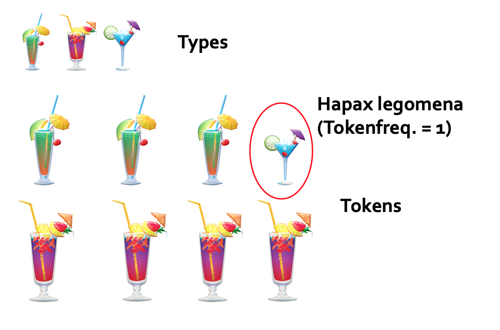

# Produktivitätsmaße

Um die Produktivität sprachlicher Muster zu messen, bedient man sich i.d.R. dreier Größen, die auch in anderen Bereichen relevant sind. Für die gängigen Produktivitätsmaße benötigt man nämlich

- die Anzahl der Tokens
- die Anzahl der Types
- die Anzahl der Hapax Legomena.

Was hat es damit auf sich? 

- **Tokens** bezieht sich die Gesamtzahl der Wörter, die zu einem Wortbildungsmuster gehören. Angenommen, wir interessieren uns für Derivate auf *-heit* und *-keit* wie *Freiheit* und *Ehrlichkeit* und finden in einem winzig kleinen Korpus die Belege *Freiheit*, *Freiheit*, *Freiheit*, *Ehrlichkeit*, *Faulheit* und nochmal *Faulheit*, dann sind das insgesamt sechs Tokens, also sechs Vorkommnisse.
- **Types** bezeichnet die Anzahl der unterschiedlichen Instanzen eines Wortbildungsmusters. Im eben genannten Beispiel wären dies die drei Lexeme *Freiheit*, *Ehrlichkeit* und *Faulheit*.
- **Hapax Legomena** bezeichnet diejenigen Instanzen, die genau ein einziges Mal belegt sind. In unserem Beispiel wäre das *Ehrlichkeit*. Hapax Legomena, oder kurz Hapaxe, sind deshalb interessant, weil sie häufig als Index für Neubildungen gesehen werden: Zwar ist nicht davon auszugehen, dass jedes Wortbildungsprodukt, das nur einmal in einem Korpus belegt ist, eine ad-hoc-Bildung ist, denn auch eigentlich relativ häufige Wörter können in einem Korpus durch Zufall unterrepräsentiert sein. Man geht aber dennoch davon aus, dass es eine Korrelation zwischen Neubildungen und Hapaxen gibt, sodass Hapaxe als ungefährer Richtwert für die Zahl an Neubildungen gesehen werden können (die sich ja nicht messen lässt).

An einem nicht-linguistischen Beispiel (das eine Idee von Susanne Flach aufgreift) illustriert \@ref(fig:typestokens) diese drei Konzepte. Gerade die Unterscheidung von Types und Tokens ist anhand solcher nicht-linguistischer Beispiele oft besser nachzuvollziehen. Zugleich zeigen solche Beispiele, dass das Konzept von Types immer von der Abstraktionsebene abhängt, auf der man sich gerade bewegt: Wenn es uns um die unterschiedlichen Arten von Cocktails geht, dann sehen wir dort drei Types - wenn es uns um die unterschiedlichen Arten von Getränken geht ("Cocktail" vs. "Bier" vs. "Limonade" etc.), dann sehen wir nur einen Type - nämlich Cocktails! Dementsprchend kann man auch bei der Arbeit mit linguistischen Daten Types oft auf unterschiedliche Art und Weise bestimmen (z.B. rein graphematisch, unter Zuhilfenahme von Grundformen [Lemmas] usw.).

(\#fig:typestokens)Types und Tokens

Mit Hilfe dieser drei Maße können wir uns nun den Produktivitätsmaßen annähern, die Baayen (u.a. 1993, 2009) in den 90er-Jahren vorgeschlagen hat und die seitdem immer wieder angewandt, aber auch kontrovers diskutiert wurden, da jedes dieser Maße nur einen Teilaspekt der morphologischen Produktivität erfassen kann und die Maße teilweise auch zu Fehlinterpretationen einladen, wenn man sich nicht ihrer Grenzen bewusst ist.

- Die *realisierte Produktivität* ist schlicht die Typefrequenz, die i.d.R. normalisiert berichtet wird, indem man die Anzahl der Tokens durch die Anzahl der Types teilt.

- Das wohl am häufigsten verwendete Maß ist die *potentielle Produktivität*. Sie ist der Quotient aus der Anzahl der Hapax Legomena, die zu einem Wortbildungsmuster gehören, und der Anzahl der Tokens im Korpus insgesamt. Dieses Maß wurde beispielsweise verwendet, um die Produktivität unterschiedlicher Wortbildungsmuster synchron zu vergleichen (Baayen & Lieber 1991) oder um die Produktivität desselben Wortbildungsmusters in unterschiedlichen Zeitspannen zu vergleichen (Scherer 2006, Hartmann 2016). Dabei ist jedoch zu bedenken, dass der Wert der potentiellen Produktivität von der Korpusgröße und auch von der Tokenfrequenz abhängt (vgl. z.B. Gaeta & Ricca 2006). Produktivitätswerte, die auf Grundlage unterschiedlich großer (Teil-)Korpora gewonnen wurden oder bei denen sich die Tokenfrequenz des Wortbildungsmusters zwischen den beiden (Teil-)Korpora unterscheiden, sind daher nicht unmittelbar vergleichbar - ein Problem, das leider oft nicht berücksichtigt wird (und das auch ich lange unterschätzt habe, vgl. Hartmann 2016; erst in Hartmann 2018 habe ich dem Rechnung getragen).

- Die *expandierende Produktivität* schließlich versucht zu messen, wie stark ein Wortbildungsmuster zum Wachstum des Wortschatzes einer Sprache beiträgt, indem sie die Anzahl der Hapaxe, die zum Wortbildungsmuster gehören, durch die Anzahl aller Hapaxe im Korpus teilt.

Im Folgenden werden wir uns nur mit den ersten beiden Maßen auseinandersetzen und sie an einem konkreten Beispiel errechnen.
